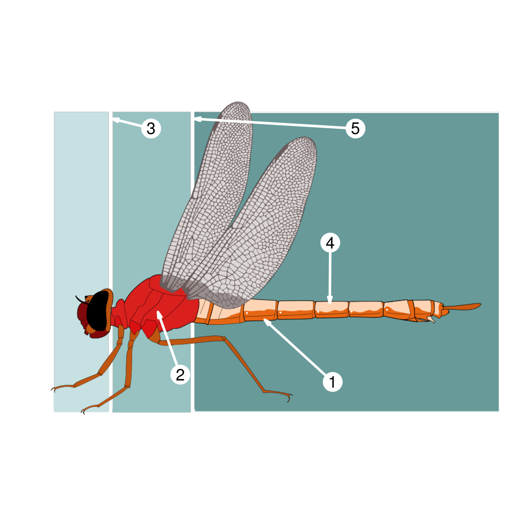

```{r, echo = FALSE, results = "hide", message=FALSE}

require( imager )

exams::include_supplement( "examsExtra.R", recursive = TRUE )
source( "examsExtra.R" )

datOut <- hotSpot( "example4/Dragonfly_anatomy-color-mudo.png", 
                   "example4/Dragonfly_anatomy.dat" )
```

Question
========
Indicates the correct codes for the structures shown in the figure.

{ width="80%"}

```{r questionlist, echo = FALSE, results = "asis"}
answerlist( datOut$questions, markup = "markdown" )
```

Solution
========

```{r solutionlist, echo = FALSE, results = "asis"}
# answerlist( ifelse(dat$solutions, "True", "False"), explanations, markup = "markdown")
```

Meta-information
================
extype: mchoice
exsolution: `r mchoice2string( datOut$solutions )`
exname: image description
